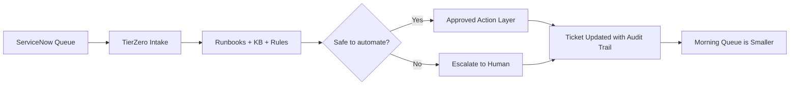

# TierZero - Buyer-Facing Architecture

## What the buyer is buying
TierZero sits beside the existing service desk stack and clears one narrow workflow safely.

It does **not** replace ServiceNow.
It does **not** bypass approvals.
It does **not** hide its actions.

It reads tickets, checks rules and runbooks, takes approved actions, and writes everything back to the ticket.

---

## Buyer view

---

## Component explanation

### 1. ServiceNow Queue
The source of truth stays where it is today.

TierZero watches a scoped queue or ticket class inside ServiceNow.

### 2. TierZero Intake
Reads the ticket, comments, metadata, attachments, and workflow context.

### 3. Runbooks + KB + Rules
Checks the documented path for the workflow:
- what conditions must be true
- what fields must be present
- what actions are allowed
- when to stop and escalate

### 4. Safe to automate?
This is the control point.

TierZero only proceeds when the ticket matches the approved workflow and required data is present.

If the case is ambiguous, out of policy, missing context, or risky, it escalates.

### 5. Approved Action Layer
This is where the work happens.

Examples:
- unlock account
- reset password through approved mechanism
- add standard note to the ticket
- route to the correct fulfillment queue
- request missing info with a draft or templated response

### 6. Audit Trail
Every decision and action is written back into the system.

The buyer gets:
- what happened
- why it happened
- what rule or runbook supported it
- whether it completed or escalated

### 7. Human Escalation
Exceptions stay with the human team.

TierZero is there to reduce repetitive work, not pretend edge cases do not exist.

---

## Safety posture

### TierZero does
- operate only inside approved scope
- follow explicit runbooks and rules
- leave a visible audit trail
- escalate exceptions cleanly

### TierZero does not
- perform hidden automation
- invent approval paths
- act when required information is missing
- silently override policy

---

## Pilot deployment shape

For the pilot, keep architecture narrow:
- one ServiceNow queue
- one ticket class
- one approved action path
- one escalation destination
- one measurement dashboard

That is enough to prove value without creating a giant enterprise-program mess.

---

## What success looks like
- smaller overnight queue
- faster first response and completion on the chosen workflow
- fewer human touches on repetitive tickets
- clean auditability for every action
- confidence to expand into the next adjacent workflow
